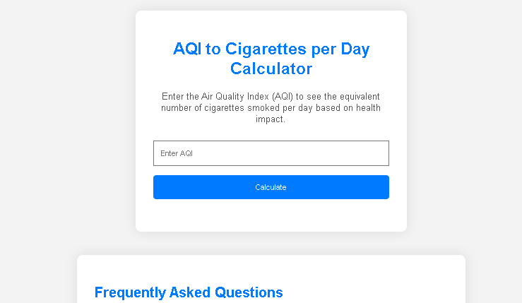

# AQI to Cigarettes per Day Calculator
## **Try it out live at [https://shauryainks.github.io/AQI-Cigarettes/](https://shauryainks.github.io/AQI-Cigarettes/)**

## Overview

The AQI to Cigarettes per Day Calculator is a simple web application that allows users to estimate the health impact of air quality by converting the Air Quality Index (AQI) into an equivalent number of cigarettes smoked per day.

## Features

- **Easy to Use**: Enter the Air Quality Index (AQI), click the "Calculate" button, and get the equivalent number of cigarettes smoked per day.
- **Health Impact Estimation**: The calculator is based on a generalization that relates AQI to the health impact, providing users with an approximation.

## How it Works

The health impact is calculated using the logic: `(AQI / 22) * 24` hours. Please note that this is an approximation and may vary based on the type of air pollution.

## Usage

1. Enter the Air Quality Index (AQI) in the provided input field.
2. Click the "Calculate" button.
3. View the equivalent number of cigarettes smoked per day.

## Frequently Asked Questions

### How is the calculation done?

The health impact is calculated based on the logic: `(AQI / 22) * 24` hours. This is an approximation and may vary based on the type of air pollution.

### Is this calculation accurate for all types of air pollution?

No, the calculation is a generalization and may not be accurate for all types of air pollution. Wood smoke, for example, may have different health impacts.

### Why does the equivalent cigarettes value round to 1 sometimes?

The rounding may occur due to the nature of the conversion and the specific breakpoints used in the calculation. It is an inherent limitation of the method.

## Connect with Me

Explore my projects on GitHub and stay updated with my latest work.

- [GitHub](https://github.com/Shauryainks)

Visit my portfolio to discover more about my skills, projects, and experiences.

- [Shauryainks.com](https://shauryainks.com)

For questions or issues, feel free to reach out:

- [Open a GitHub Issue](https://github.com/Shauryainks/AQI-to-Cigarettes-Calculator/issues)
- [Submit a Pull Request](https://github.com/Shauryainks/AQI-to-Cigarettes-Calculator/pulls)

